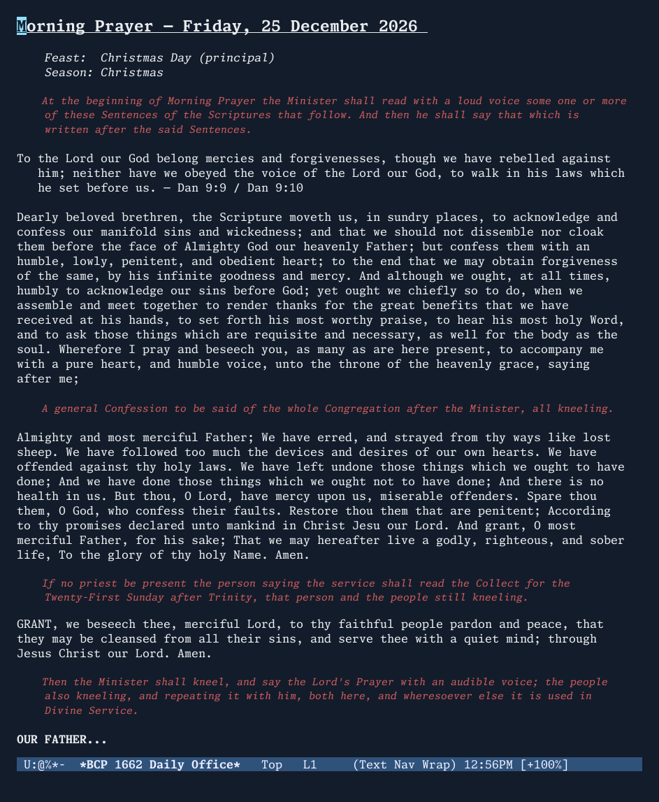
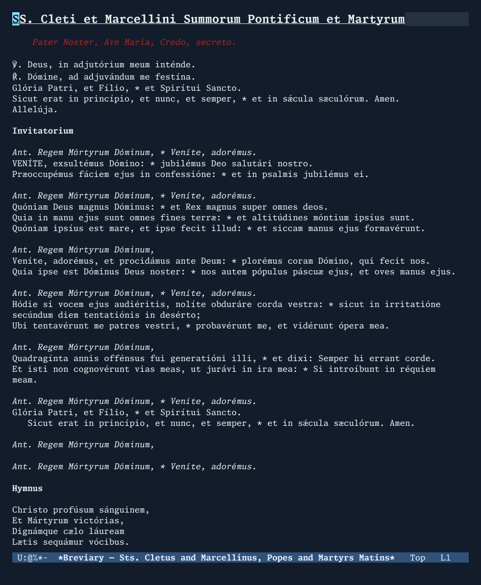
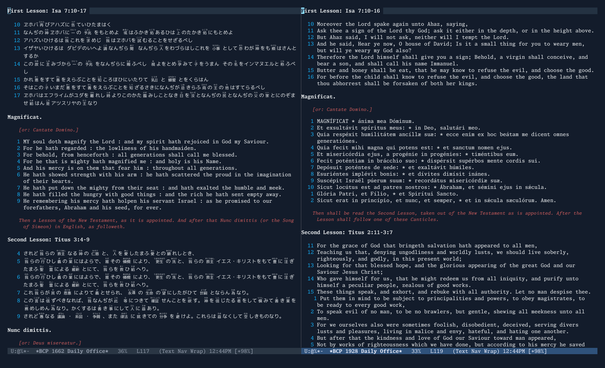
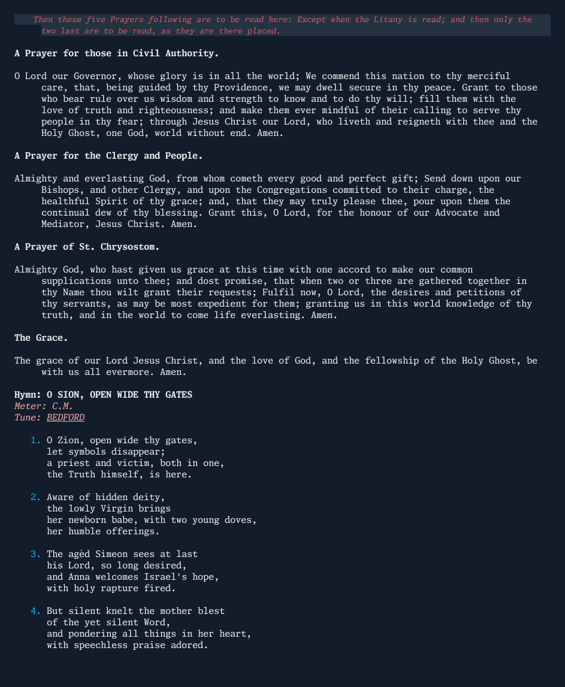
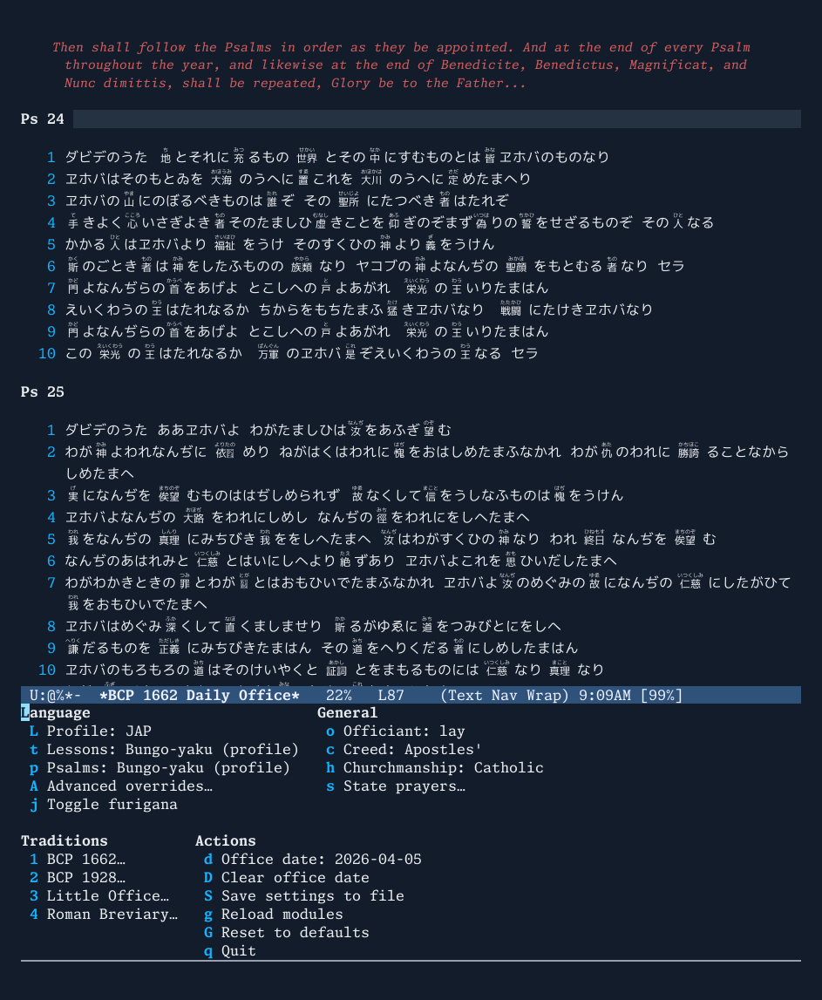

# emacs-bcp — Bible Commentary & Prayer

An Emacs Lisp framework for Bible study and liturgical prayer. It has two equal purposes: a scripture reader and annotation environment built around org and org-roam, and a Daily Office engine that renders complete liturgies with scripture lessons fetched and inserted inline. Four traditions ship feature-complete: the BCP 1662, the 1928 American BCP, the Little Office of the BVM, and the pre-1955 Roman Breviary; the architecture is designed to accommodate additional prayer books.



---

## Purpose

This project began as a simple solution to a simple problem: a dislike of marking up physical books and a desire to keep, organise, and cross-reference notes on scripture in a way that was easily searchable. Reconfiguring Emacs so that it could generate a feature-complete Daily Office with lessons inserted inline, Bea Psalter, and pre-1955 Holy Week was the obvious method of achieving this, naturally.

### Scripture study

The core of the project is a scripture reader (`bcp-reader`) and study notebook (`bcp-notebook`). Open any passage by reference, read it in a dedicated buffer with verse navigation, and work alongside a linked org commentary file. With org-roam loaded, backlinks surface every note that touches the current passage, and org-capture provides one-keystroke marginal annotation. The same fetch layer that supplies Office lessons supplies the reader, so the same translation settings and fallback chain apply throughout.

### Daily Office

The prayer side renders the full text of the Daily Office as a read-only buffer, with psalms, prayers, and lessons fetched and inserted inline. No external browser or PDF viewer is required.

Four traditions are implemented:

- **BCP 1662** — the English prayer book; full liturgical calendar with moveable feasts and user-defined observances
- **1928 American BCP** — the pre-revision American prayer book; full liturgical calendar and lectionary
- **Little Office of the BVM** — the Roman Office (*Officium Parvum BMV*), DA 1911 rubrics; all eight canonical hours with Latin/English bilingual rendering
- **Roman Breviary** — the pre-1955 (Divino Afflatu) Roman Breviary, all eight canonical hours with Latin/English/Japanese trilingual rendering, weekly psalter cycle, dominical and festal Matins with full lessons, Proprium Sanctorum, Commune Sanctorum, and four seasonal Propers of the Time (Advent, Lent, Eastertide, Christmastide); Holy Week and Sacred Triduum offices

The Anglican traditions share a common rendering layer (`bcp-anglican-render`) parameterised by a tradition context. The Roman Office has its own parallel renderer (`bcp-roman-render`). Support for the 1979 American BCP is planned.

---

## Scope

The current implementation covers:

**Scripture study:**
- Passage fetch by reference (`John 3:16`, `Psalm 23`, `Genesis 1:1-2:3`)
- Side-by-side or top-bottom layout: scripture buffer and org commentary file
- Proportional scroll synchronisation between the two buffers
- org-roam backlink panel for the current passage
- org-capture integration for quick marginal notes
- Verse number display with toggle; verse-based navigation

**BCP 1662 Daily Office:**
- Complete Morning and Evening Prayer ordos with rubrical options throughout
- Seasonal opening sentences (1662 pool and extended 1928 BCP corpus)
- Configurable canticles with Latin Vulgate texts and per-canticle language overrides
- Lessons (OT and NT) fetched and inserted inline; Communion propers optionally appended
- Collects of the Day resolved from the full liturgical calendar
- Support for user-defined additional prayers and feasts

**1928 American BCP Daily Office:**
- Complete Morning and Evening Prayer ordos
- Seasonal opening sentences from the 1928 corpus
- Full 1928 lectionary (original 1928 edition, not the 1945 revision)
- 1928 canticles including Benedictus es Domine
- Collects and Communion propers from the 1928 BCP

**Little Office of the BVM (Roman):**
- All eight canonical hours: Matins, Lauds, Prime, Terce, Sext, None, Vespers, Compline
- Auto-hour selection based on time of day
- Latin/English bilingual rendering (Marquess of Bute 1908 prose translation)
- Hymnal with multiple named English translators per hymn (Britt, Caswall, Neale)
- Scripture capitula resolved via the configurable fetch layer (user's preferred Bible translation)
- Seasonal Marian antiphons (Alma Redemptoris, Ave Regina, Regina caeli, Salve Regina)
- Penitential season Alleluia suppression

**Roman Breviary:**
- All eight canonical hours: Matins, Lauds, Prime, Terce, Sext, None, Vespers, Compline
- Auto-hour selection based on time of day
- Multilingual rendering governed by the language profile (Latin, English, Japanese)
- Weekly psalter cycle from `bcp-roman-psalterium` (DA cursus for Matins: 12 psalms under 6 antiphons)
- Per Annum collects from the preceding Sunday (Pentecost I–XXIV)
- Ferial preces (Lauds, Vespers, Prime, minor hours) with dominical/ferial switching
- Suffragium sanctorum (Lauds and Vespers)
- Invitatory antiphon and Venite (Matins)
- Lectio brevis with short responsory (ferial Matins)
- Dominical Matins: 3 nocturns with 9 psalms, 3 versicles, 9 lessons, 8 responsories, Te Deum
- Festal Matins: proper office for all 14 feasts with no commune, commune-based office for all others
- Incipit-keyed registries: 537 antiphons, 60 hymns, collects, and responsories
- Proprium Sanctorum: ~180 feasts across the calendar year with proper collects
- Commune Sanctorum: 7 communes (Apostles, Martyrs, Confessor Bishop, Confessor non-Bishop, Virgins, Holy Women, BVM) with full Matins lessons and responsories
- Four seasonal Propers of the Time: Advent, Lent, Eastertide, Christmastide — each with proper antiphons, capitula, and Matins data
- Holy Week: Palm Sunday through Holy Saturday with proper offices
- Sacred Triduum: Tenebrae Matins with Lamentations, proper Lauds, Vespers rubrics



**State prayers (both Anglican traditions):**
- Three versicle forms — monarchy / *save the State* (1928) / *them that rule* (1662) — selectable independently of region on theological grounds
- Sovereign name, title (king/queen), and royal family members configurable; rendered in ALL-CAPS to mark as requiring update at succession
- President's name injected per the 1928 *N.* rubric; rendered in ALL-CAPS

**Liturgical calendars:**
- Full BCP 1662 calendar including fixed feasts, moveable feasts, and occurrences
- Full 1928 American BCP calendar and sanctoral
- User-defined feast overrides (1662)

**Language profiles:**
- Three built-in profiles — ENG (English/Coverdale/KJVA), LAT (Latin/Vulgate), JAP (Japanese/文語訳) — each setting all scripture and liturgical language defaults at once
- Per-setting overrides for mixing and matching (e.g. Latin structural texts with Japanese scripture)
- Furigana display system for Japanese text: normal, muted (comment), or hidden, with in-buffer toggle



**Bible backends** (served for all scripture — `bcp-fetcher-backend`):
- `oremus` — Oremus Bible Browser (online); KJVA, KJV, NRSV, NRSVAE, and psalm-specific versions
- `ebible` — local eBible.org plain-text chapter files; fully offline
- `bungo-yaku` — 文語訳聖書 (1917 Taishō revision), the complete 66-book Japanese Bible with furigana; served locally from a bundled text file

**Hymns and tunes:**
- Office hymn rendering integrated with all four traditions; selection driven by a controlled-vocabulary tag system over a unified text registry that covers The Hymnal 1940 (Episcopal) and the Roman office hymnal in three English translations (Britt, Caswall, Neale)
- Deterministic, non-repeating hymn picks: a `date + office + slot` seed picks from the tag-eligible pool, and prior-office picks on the same day are excluded so Mattins and Evensong draw distinct hymns without any persistent state
- Tune metadata for ~640 tunes; tune names render as clickable YouTube recording links where one is registered (586 of the 1940's tunes)
- Per-translator meter notation printed under each hymn title; when a hymn text has no appointed setting, a fallback table by time-of-day + meter suggests a widely-known tune (e.g. TE-LUCIS / TALLIS' CANON for evening L.M.)



**Psalters** (served for Psalms only, layered on top of the backend — `bcp-fetcher-psalter`):
- `coverdale` — Miles Coverdale's Psalter (BCP 1662), bundled local text file
- `tate-brady` — Tate & Brady metrical psalter (1698 corrected edition), bundled local text file
- `vulgate` — Latin Vulgate Psalter with Breviary pointing (*, †, ‡), bundled local text file, BCP-to-Vulgate numbering mapping

---

## How It Works

### Architecture

The codebase is divided into five domains:

| Prefix | Domain |
|--------|--------|
| `bcp-` | Shared framework: computus, feast rank taxonomy, fetch/parse layer, buffer primitives |
| `bcp-liturgy-` | Generic Office machinery: canticle registry, ordo walker protocol, canonical hours |
| `bcp-common-` | Shared text pools: `bcp-common-prayers` (ecumenical), `bcp-common-anglican` (Anglican family), `bcp-common-canticles`, `bcp-common-roman` (Roman fixed texts, Latin + English) |
| `bcp-anglican-` | Shared Anglican render layer (`bcp-anglican-render`); tradition files: `bcp-1662-`, `bcp-anglican-1928-` |
| `bcp-roman-` | Roman Office: renderer, ordo, hymnal, psalterium, tempora; tradition files: `bcp-roman-lobvm` (LOBVM), `bcp-roman-breviary` (ferial Breviary) |
| `bcp-reader` / `bcp-notebook` | Scripture reader and study notebook |

The fetch layer (`bcp-fetcher`) is shared by both the scripture reader and the Office engine. Translation settings, fallback chains, and caching apply uniformly across both.

The shared rendering layer (`bcp-anglican-render`) implements the ordo walker and step dispatch for the classical Anglican BCP family. Tradition-specific files (e.g. `bcp-1662-render`, `bcp-anglican-1928-render`) build a context plist and delegate to it; they own only what genuinely differs — rubric face, Venite rules, ref-label format, collect dispatch.

### Rendering pipeline

1. `bcp-1662-open-office` (or `bcp-1928-open-office`) determines the office from the current time and date
2. `bcp-1662-propers-for-date` (or `bcp-1928-propers-for-date`) resolves the liturgical day: feast, season, week, collect, lessons, and communion propers
3. All psalm and lesson passages are fetched in parallel via the `bcp-fetcher` layer
4. Once all fetches complete (or time out), the tradition's render function builds a context plist and passes it to `bcp-anglican-render--render-office`, which walks the ordo step sequence and inserts the full liturgy into the office buffer
5. The buffer is rendered read-only with overlays for verse numbers, rubric colouring, and heading styles

### Fetch backends and psalters

Scripture fetches pass through a two-layer pipeline. The **psalter** layer (`bcp-fetcher-psalter`) handles Psalms only; the **backend** layer (`bcp-fetcher-backend`) handles everything else, plus Psalms when no psalter is set. Fallback chain:

0. **Active psalter** (if set and passage is a Psalm)
1. **Primary backend** with preferred translation
2. **Primary backend** with fallback translation (default: KJVA)
3. **Fallback backend** with preferred translation

Bible backends:

- `oremus` — fetches from [Oremus Bible Browser](https://bible.oremus.org) (online); supports KJVA, KJV, NRSV, NRSVAE, and psalm-specific versions (Coverdale/BCP, Common Worship, Liturgical Psalter)
- `ebible` — fetches from a local directory of eBible.org plain-text chapter files; fully offline
- `bungo-yaku` — serves the complete 文語訳聖書 from `bcp-liturgy-bungo-yaku.txt` (local, no network required); 31,099 verses with furigana as `kanji《reading》`

Psalters:

- `coverdale` — Miles Coverdale's Psalter from `bcp-liturgy-psalter-coverdale.txt`
- `tate-brady` — Tate & Brady metrical psalter from `bcp-liturgy-psalter-tate-brady.txt`
- `vulgate` — Latin Vulgate Psalter from `bcp-liturgy-psalter-vulgate.txt` (applies BCP-to-Vulgate psalm number mapping, e.g. BCP 114 → Vulgate 113:1-8, BCP 116 → Vulgate 114+115 concatenated)

The fetch layer also supports translation-aware routing: if the caller passes an explicit translation (e.g. "Vulgate") that matches a registered backend or psalter, that source is used regardless of the current backend/psalter setting.

The default configuration is `oremus` backend + `coverdale` psalter. Psalms are served locally via Coverdale; lessons come from Oremus.

---

## Installation

### Quick start

1. Clone or download this repository into a directory on your Emacs load path, e.g. `~/.emacs.d/elisp/`.

2. Add the following to your `init.el`:

```elisp
(add-to-list 'load-path (expand-file-name "elisp/" user-emacs-directory))
(require 'bcp)
```

3. Configure via the menu: `M-x bcp-settings`. Press `S` to save your settings — they persist to your Emacs `custom-file` and survive restarts.

That's it. The package ships with sensible defaults (English profile, Coverdale psalter, KJVA lessons). No further setup required.

### Optional: bind entry commands

```elisp
(global-set-key (kbd "C-c o") #'bcp-1662-open-office)
(global-set-key (kbd "C-c O") #'bcp-1928-open-office)
(global-set-key (kbd "C-c r") #'bcp-roman-lobvm)      ; LOBVM, auto-selects hour
(global-set-key (kbd "C-c R") #'bcp-roman-breviary)   ; Breviary, auto-selects hour
```

### Optional: scripted config (`bcp-preferences.el`)

Power users can drop a `bcp-preferences.el` anywhere on the load-path with plain `setq` forms; `bcp.el` auto-loads it if present. Useful for sharing a setup across machines or keeping config in a dotfiles repo. Values set there win over `bcp-settings → Save` (standard Emacs convention: explicit `setq` beats Customize). The file is `.gitignored` from this repository — it is treated as personal config, not part of the public package.

### Coverdale Psalter

The file `bcp-liturgy-psalter-coverdale.txt` is included in the repository. It contains all 150 psalms in Miles Coverdale's translation (the BCP 1662 Psalter) in a tab-separated format parsed by the Coverdale backend. No additional setup is required.

If you need to regenerate it (e.g. after updating the source files), load `bcp-coverdale-download.el` and call `M-x bcp-coverdale-download-collate`.

### Vulgate Psalter

The file `bcp-liturgy-psalter-vulgate.txt` is included in the repository. It contains all 150 psalms of the Latin Vulgate Psalter under Vulgate numbering, with Breviary pointing marks (*, †, ‡) preserved. Collated from the [Divinum Officium](https://divinumofficium.com/) Latin psalm source files.

To regenerate, load `bcp-vulgate-collate.el` and call `M-x bcp-vulgate-collate`.

### eBible backend (optional, fully offline)

Download the plain-text KJV chapter files from [eBible.org](https://ebible.org) and set:

```elisp
(require 'bcp-fetcher-ebible)
(setq bcp-fetcher-backend 'ebible
      bcp-fetcher-ebible-directory "/path/to/eng-kjv/")
```

---

## Customisation

The recommended path is `M-x bcp-settings` → tweak → `S` to save. Settings persist to your Emacs `custom-file`. Power users can also `setq` variables in `init.el` or in an optional `bcp-preferences.el` file (see *Installation* above).



> **Note on symbol names.** A number of customisation variables still carry the legacy `bible-commentary-` prefix from the project's pre-rename era (e.g. `bible-commentary-psalm-translation`). These will be unified under the `bcp-` prefix in a future release; existing configurations will continue to work.

### Language profile

A language profile sets all scripture and liturgical language defaults at once. Use `M-x bcp-settings` → Language to switch profiles or override individual settings.

```elisp
;; English: Coverdale psalms, KJVA lessons, English office texts
(setq bcp-language-profile 'ENG)

;; Latin: Vulgate psalms, Vulgate lessons, Latin office texts
(setq bcp-language-profile 'LAT)

;; Japanese: Bungo-yaku psalms and lessons, English structural texts
(setq bcp-language-profile 'JAP)
```

Individual settings can be overridden while keeping the profile as a base:

```elisp
;; Override just the lesson translation (e.g. Latin profile but NRSV lessons)
(setq bcp-profile-lesson-translation "NRSV")

;; Override just the backend (e.g. English profile but Bungo-yaku scripture)
(setq bcp-profile-backend 'bungo-yaku)

;; Override just the psalter (e.g. English profile but Tate & Brady psalms)
(setq bcp-profile-psalter 'tate-brady)

;; Reset an override back to the profile default
(setq bcp-profile-lesson-translation 'default)
```

### Fetch backend and psalter

Normally set by the language profile. The Bible backend and the
fallback backend are independent; the active psalter is **derived**
from the psalm translation — pick a translation name served by a
registered psalter (Coverdale, Tate & Brady, Vulgate) and psalms
will route through that psalter automatically. Any other name (NRSV,
KJVA, Bungo-yaku, …) leaves the Bible backend to serve psalms.

```elisp
;; Default: Oremus for lessons, Coverdale for psalms
;; (psalter is derived from the "Coverdale" psalm translation)
(setq bcp-fetcher-backend 'oremus
      bible-commentary-psalm-translation "Coverdale"
      bcp-fetcher-fallback-backend 'oremus)

;; Tate & Brady metrical psalms, Oremus for lessons
(setq bcp-fetcher-backend 'oremus
      bible-commentary-psalm-translation "Tate & Brady")

;; Latin Vulgate psalms, Oremus for lessons
(setq bcp-fetcher-backend 'oremus
      bible-commentary-psalm-translation "Vulgate")

;; Japanese: Bungo-yaku for everything including psalms (no psalter layer)
(setq bcp-fetcher-backend 'bungo-yaku
      bible-commentary-psalm-translation "Bungo-yaku"
      bcp-fetcher-fallback-backend 'oremus)

;; Fully online (Oremus only, NRSV psalms from Oremus)
(setq bcp-fetcher-backend 'oremus
      bible-commentary-psalm-translation "NRSV"
      bcp-fetcher-fallback-backend nil)
```

If you bypass the profile layer entirely, you can still set
`bcp-fetcher-psalter` directly; it is a symbol (e.g. `'coverdale`,
`'tate-brady`, `'vulgate`, or `nil`).

### Officiant order

Affects the form of the Absolution (priest says it; lay or deacon receives a substitute collect):

```elisp
(setq office-officiant 'lay)   ; lay deacon priest bishop
```

### State prayers

The civil-authority versicle in the Preces and the state prayers said after the Office are controlled independently.

```elisp
;; Versicle form — choose on theological grounds, not merely geographic ones.
;; 'monarchy       — "O Lord, save the King." (or Queen)
;; 'state          — "O Lord, save the State."  (1928 American republican form)
;; 'them-that-rule — "O Lord, save them that rule."  (1662 international form)
(setq bcp-liturgy-state-versicle-form 'state)

;; Region — controls which state prayers are said after the Office.
;; 'monarchy  — sovereign, royal family, clergy
;; 'us        — President of the United States, clergy (1928 American wording)
;; 'republic  — civil authority, clergy (generic)
(setq bcp-liturgy-region 'us)

;; Sovereign (when bcp-liturgy-state-versicle-form is 'monarchy)
(setq bcp-liturgy-sovereign-title 'king)   ; 'king or 'queen
(setq bcp-liturgy-sovereign-name "Charles")  ; inserted as KING CHARLES in the prayer

;; Royal family members named in the prayer (before "and all the Royal Family")
(setq bcp-liturgy-royal-family-names
      "Queen Camilla, William Prince of Wales, the Princess of Wales")

;; President's name, inserted per the 1928 N. rubric (rendered in ALL-CAPS)
;; nil omits the name: "Grant to the President of the United States..."
(setq bcp-liturgy-president-name "Donald")
```

Names rendered in ALL-CAPS in the office buffer serve as a visual reminder to update them when the officeholder changes.

### BCP 1662 rubrical options

```elisp
;; Omit penitential introduction on weekdays
(setq bcp-1662-omit-penitential-intro nil)

;; Opening sentence corpus
(setq bcp-1662-opening-sentence-corpus '1662)
;;   '1662     — eleven penitential sentences from the BCP 1662
;;   'extended — seasonal sentence from the 1928 BCP; falls back to 1662 pool

;; Opening sentence selection (when corpus is '1662)
(setq bcp-1662-opening-sentence-selection 'auto)
;;   'auto — one sentence, rotated by date
;;   'all  — all sentences read

;; Form of the Bidding ("Dearly beloved brethren...")
(setq bcp-1662-bidding-form 'full)
;;   'full  — complete 1662 text
;;   'brief — "Let us humbly confess our sins unto Almighty God." (1928 BCP)
;;   'omit  — omit entirely

;; General Confession variant
(setq bcp-1662-general-confession-form nil)
;;   nil      — standard 1662 text
;;   'variant — adds "And apart from thy grace, there is no health in us."
;;   'omit    — omit entirely

;; Venite: omit verses 8-11 outside Lent and Passiontide
(setq bcp-1662-omit-venite-passiontide nil)

;; Easter Anthems throughout all of Eastertide (not just Easter Day)
(setq bcp-1662-easter-anthems-throughout-eastertide nil)

;; Show Communion propers (OT reading, Epistle, Gospel) in the office buffer
(setq bcp-1662-show-communion-propers t)
```

### 1928 American BCP rubrical options

```elisp
;; Omit penitential introduction on weekdays
(setq bcp-1928-omit-penitential-intro nil)

;; Show Communion propers in the office buffer
(setq bcp-1928-show-communion-propers t)

;; Rubric style
(setq bcp-1928-rubric-style 'red)   ; 'red or 'comment
```

### Canticles

```elisp
;; Append Gloria Patri after each canticle and psalm (normally set by profile)
(setq bcp-liturgy-canticle-append-gloria nil)

;; Default canticle language (normally set by profile)
(setq bcp-liturgy-canticle-language 'english)   ; 'english or 'latin

;; Per-canticle language overrides
(setq bcp-liturgy-canticle-overrides '((te-deum . latin)))
```

### Roman Office (LOBVM and Breviary)

```elisp
;; Office language (normally set by the language profile)
(setq bcp-roman-office-language 'latin)   ; 'latin or 'english
;; Any non-latin value uses English structural texts and fetcher-based scripture/psalms

;; Preferred hymn translator (English mode)
(setq bcp-roman-hymnal-preferred-translator 'britt)
;;   'britt    — Dom Matthew Britt, O.S.B. (1922)
;;   'caswall  — Edward Caswall (1849)
;;   'neale    — John Mason Neale (1851)
;;   'primer   — The Primer tradition

;; Translator fallback order
(setq bcp-roman-hymnal-fallback-order '(britt caswall neale primer))
```

Both settings are also available from the transient menu (`M-x bcp-settings`, then `R` for the Roman Office submenu).

### Rendering

```elisp
;; Rubric style (BCP 1662)
(setq bcp-1662-rubric-style 'red)
;;   'red     — traditional liturgical red
;;   'comment — inherits font-lock-comment-face (theme-aware grey)

;; Morning Prayer cutoff hour (0-23)
(setq bcp-1662-morning-prayer-hour-limit 12)
```

### User-defined feasts (BCP 1662)

Add local or diocesan observances in `bcp-1662-user-feasts.el`. Each entry specifies a date, rank, collect, and lessons. See the file for format documentation.

### Additional prayers (BCP 1662)

```elisp
;; Append extra prayers after the five state prayers
(setq bcp-1662-additional-prayers
      '(my-prayer-for-the-sick
        "Almighty God, the fountain of all wisdom…"))
```

### Reload after changes

```elisp
M-x bcp-reload
```

Reloads all package files in dependency order without restarting Emacs.

---

## Acknowledgements

### Liturgical and scriptural texts

**The Book of Common Prayer 1662** is a work of the Church of England and is in the public domain. The text of the 1662 BCP used here follows the standard edition.

**The Book of Common Prayer 1928** (American) is in the public domain. The text of the collects, canticles, prayers, and liturgical calendar used here follows the standard 1928 edition.

**The Coverdale Psalter** — Miles Coverdale's translation of the Psalms, appointed in the BCP 1662 — is in the public domain. The bundled `bcp-liturgy-psalter-coverdale.txt` was prepared from the Oremus Bible Browser's BCP psalter texts.

**The Marquess of Bute's** translation of the Roman Breviary (1908) provides the English prose translations for the Little Office of the BVM. Hymn translations are attributed to their individual translators: Dom Matthew Britt, O.S.B. (1922), Edward Caswall (1849), and John Mason Neale (1851).

### Digital sources

**Oremus Bible Browser** ([bible.oremus.org](https://bible.oremus.org)) is maintained by the Church of England and has provided free public access to scripture texts since the late 1990s. This project depends on it as its primary online scripture source.

**eBible.org** provides freely downloadable plain-text scripture files used by the optional `bcp-fetcher-ebible` backend.

**[Divinum Officium](https://divinumofficium.com/)** provides the Latin source texts for the Roman Office implementation. The project's freely available liturgical data files made it possible to pre-extract the complete Office texts. This project was inspired by Divinum Officium and represents the author's attempt to create a comparable service for the Book of Common Prayer and the Roman Breviary.

### Recordings

**Andrew Remillard** has performed and uploaded a complete instrumental playthrough of the [*Hymnal 1940*](https://www.youtube.com/playlist?list=PLZZAT1pP5dJrWsu25T4gVyIAC8nOI-lP8) on YouTube. Each "Tune:" line in a rendered hymn is a clickable link to his recording of that tune; the project hosts nothing and fetches nothing at runtime.

### Inspirations and personal thanks

The author's love of the Roman Office owes much to the ***Anglican Breviary*** (Frank Gavin Liturgical Foundation; currently maintained by the Lancelot Andrewes Press). No text has been drawn from that copyrighted work; all Latin and English texts in this project are sourced independently from the public domain.

The author would like to extend thanks to the creators of the [*1662 Daily Office Podcast*](https://creators.spotify.com/pod/profile/1662pod/) produced by [Trinity Anglican Church](https://trinityconnersville.com/) (Connersville, IN), for lowering the barrier of regularly praying Morning and Evening Prayer.

The author also wishes to thank the many wonderful members of the Personal Ordinariate of St. Peter for their personal kindness and their work in raising awareness of the richness of the Anglican traditions.

### Tools

This project was developed with the assistance of [Claude Code](https://claude.ai/claude-code) (Anthropic).

---

## Status

This project is in active personal use and development; both the scripture study and Office sides are in regular use. It is shared in the hope that others in the Anglican tradition who use Emacs may find it useful. Contributions, corrections, and suggestions are welcome.

Planned additions include: the 1979 American BCP, additional hymn translations, Coverdale/KJVA translations for scripture-derived antiphons, a psalm pointing utility, and CJK prayer book texts.
